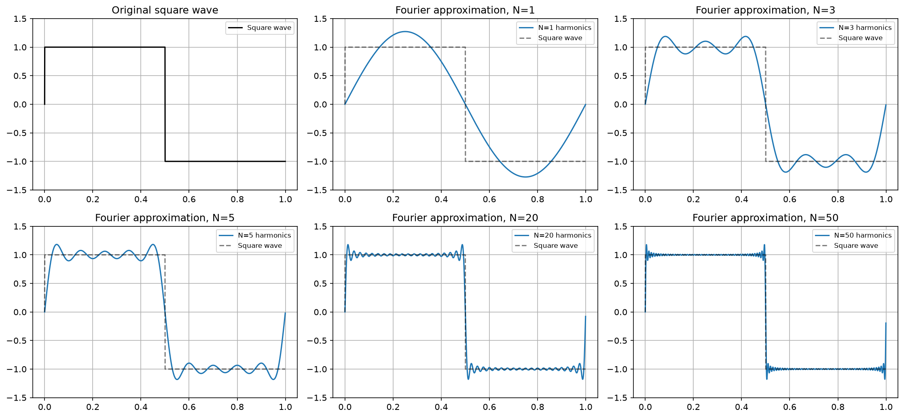
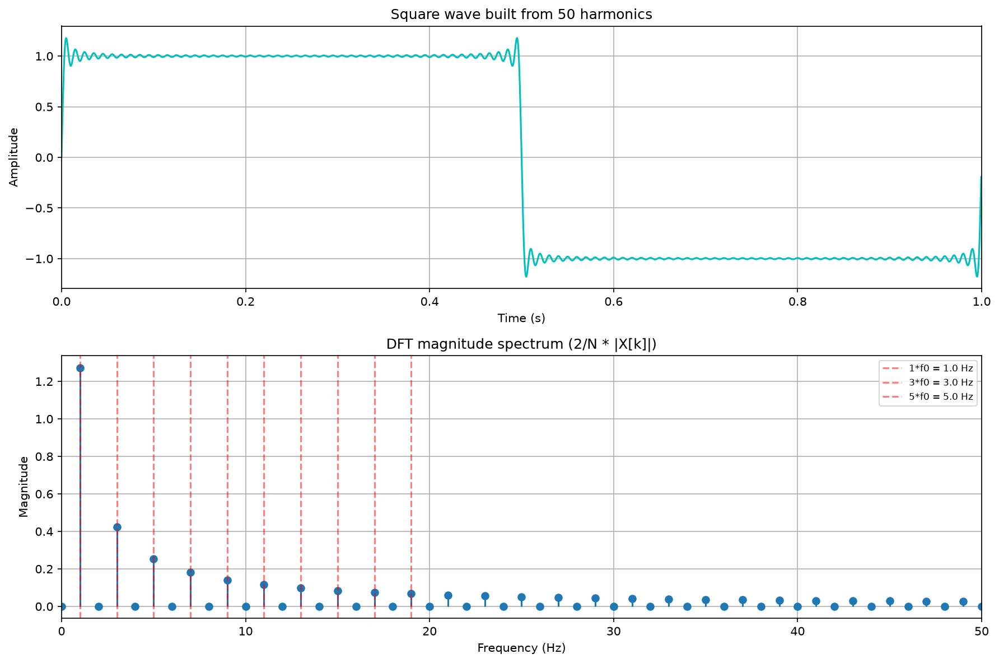
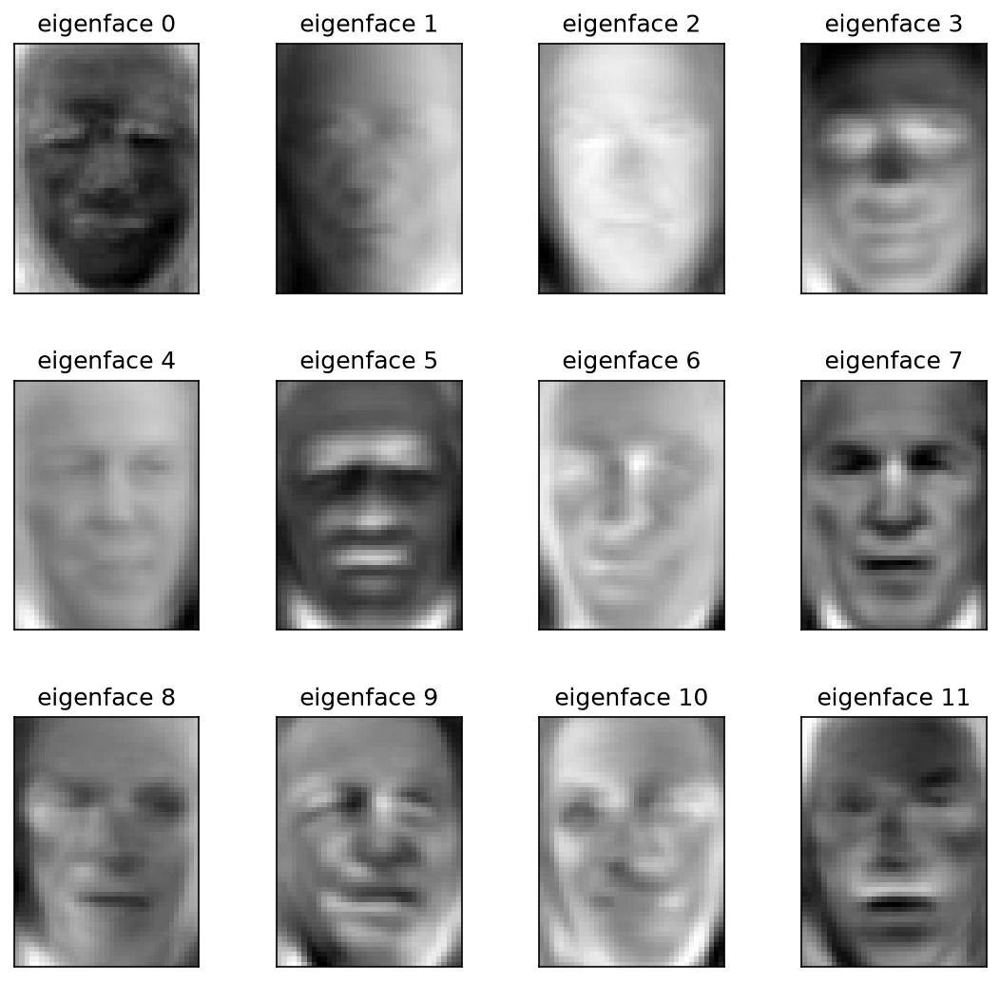
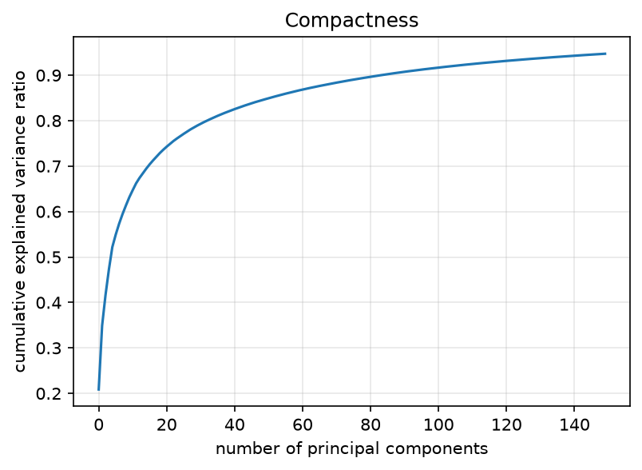
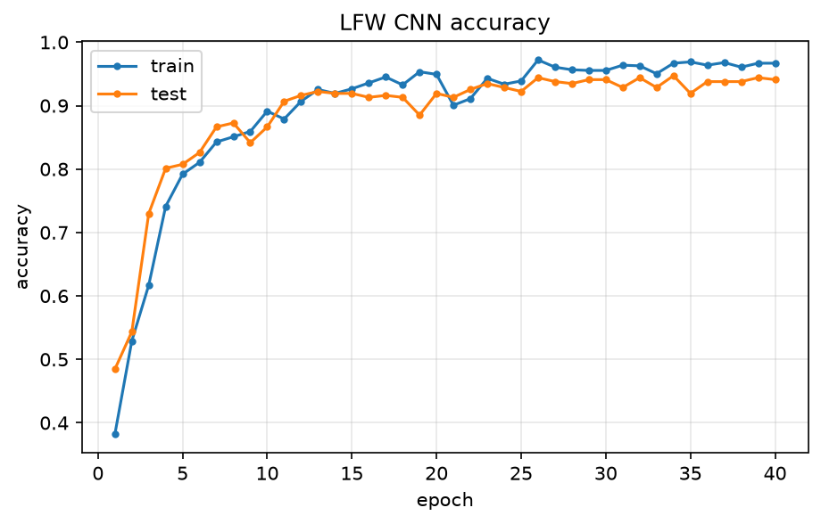

# COMP3710 Pattern Analysis - Lab Demonstration 2: Pattern Recognition

PyTorch / NumPy implementations of every task in the *Pattern Recognition* demonstration sheet
(v2.01): the discrete Fourier transform, eigenfaces, CNN classifiers (LFW + a DAWNBench-style
ResNet-18 on CIFAR-10) and the recognition problems on the pre-processed OASIS brain MRI dataset
(VAE, UNet segmentation, DCGAN).

## Current review: Hard track (VAE + UNet + GAN)

See [current evidence](docs/CURRENT_STATUS_zh.md), [verified original rubric](docs/HARD_RUBRIC_VERIFIED_zh.md),
and [GAN experiment](docs/GAN_RESULTS_zh.md). Hard recognition has a **7/7 maximum**, plus the separate
**1-mark Git course**; these are ceilings, not awarded marks.

On Windows RTX 5080, DFT timing and VAE/UNet/GAN inference have been rerun. UNet still reaches
**0.9982 / 0.9267 / 0.9401 / 0.9665** on all 544 test slices at **128x128**.
An OASIS GAN baseline collapsed; adding experimental coarse spatial moment regularization improved
sample diversity after 60 epochs. Independent validation-reference distance ratio increased from
**0.0537 to 0.8930**. This is a diversity diagnostic, not a realism score or proof of full mode coverage.
The instructor assesses GAN realism. New training and inference examples are below.

The shared conversation reports Rangpur CIFAR-10 TTA accuracy 94.00% in 91.3 seconds of training
(99.4 seconds including evaluation); its original server artifacts still need retrieval.
Required live Rangpur demonstration, Git course evidence and personal viva remain outstanding.
Parts 2 and 3.1 below retain historical results, not new Windows runs.


| Part | Task | Entry point | Status |
|------|------|-------------|--------|
| 1 | Square wave Fourier series, naive DFT vs FFT, PyTorch/GPU DFT timing | `part1_dft/square_wave_numpy.py`, `part1_dft/dft_torch.py` | CPU and RTX 5080 timings verified; see current evidence |
| 2 | Eigenfaces (PCA via SVD) + Random Forest on LFW | `part2_eigenfaces/eigenfaces.py` | done, accuracy 0.61 |
| 3.1 | CNN classifier on LFW (2 x conv3x3/32 + dense) | `part3_cnn/lfw_cnn.py` | done, accuracy 0.94 |
| 3.2 | DAWNBench: ResNet-18 on CIFAR-10, mixed precision, > 94 % target | `part3_cnn/dawnbench/train_cifar10.py` | A100 results reported in shared conversation; original artifacts and live demo pending |
| 4.1 | Advanced Git Course | course completion proof | not yet supplied |
| 4.4 / Task 1 | VAE of OASIS brains + latent manifold (grid / UMAP) | `part4_recognition/vae/train.py` | trained on all supplied, official-verified PNGs; see Medium report |
| 4.4 / Task 2 | UNet segmentation of OASIS, per-class DSC > 0.9, one-hot output | `part4_recognition/unet/train.py`, `predict.py` | trained on all supplied, official-verified PNGs; see Medium report |
| 4.4 / Task 3 | DCGAN brain generation on OASIS | `part4_recognition/gan/train.py` | 60-epoch OASIS run and anti-collapse comparison completed locally; see GAN report |

Everything is written from scratch (no pre-trained / pre-built models). All scripts are plain
`argparse` programs that pick the best device automatically (CUDA on Rangpur, Apple MPS on a Mac,
otherwise CPU) and write figures, metrics (`*.json`) and checkpoints under `results/<part>/`.

Verified CPU numbers for Parts 1-3.1 (this development machine, no GPU) live in
[`docs/results/verified_cpu_results.json`](docs/results/verified_cpu_results.json): DFT/FFT timings,
eigenfaces compactness + 0.612 RF accuracy, LFW CNN 0.941.

Convenience scripts:

```bash
bash scripts/run_cpu_parts.sh          # Parts 1, 2, 3.1 on CPU
bash scripts/run_oasis_local.sh        # Medium: VAE + UNet against local OASIS; RUN_GAN=1 opts into Hard
```

---

## 1. Setup

The lab sheet requires a GitHub repository **under your own account** (the demonstrator may ask you
to log in). After creating the GitHub repo, add it as `origin` and push `main`.

```bash
git clone <this repository> && cd <repo>
python -m venv .venv && source .venv/bin/activate
pip install -r requirements.txt            # CPU / Apple-silicon build of PyTorch
# on Rangpur / any CUDA machine use the CUDA wheels instead, e.g.
# pip install torch torchvision --index-url https://download.pytorch.org/whl/cu121
```

Datasets:

* **LFW** (Parts 2, 3.1) and **CIFAR-10** (Part 3.2) are downloaded automatically by
  scikit-learn / torchvision (~200 MB + 170 MB). Rangpur *compute* nodes may be offline: download
  CIFAR-10 once on the login node with
  `python -c "import torchvision; torchvision.datasets.CIFAR10('data/cifar10', download=True)"`.
* **OASIS** (Part 4) - the pre-processed PNG slices `keras_png_slices_data`:
  `/home/groups/comp3710/OASIS` on Rangpur, or a local copy (e.g. `~/Downloads/keras_png_slices_data`).
  Pass the folder with `--data_root` or set `OASIS_ROOT`. The loader accepts both the folder that
  directly contains `keras_png_slices_train/` and its parent. Check it with
  `python part4_recognition/oasis_data.py --data_root <path>`.

Repository layout:

```
common/                 device selection, seeding, plotting, checkpoint I/O
part1_dft/              Fourier series + DFT (NumPy and PyTorch versions, GPU timing study)
part2_eigenfaces/       PCA eigenfaces + random forest
part3_cnn/lfw_cnn.py    small CNN for LFW
part3_cnn/dawnbench/    ResNet-18, GPU-resident CIFAR-10 pipeline, fast trainer
part4_recognition/      oasis_data.py (dataset) + vae/ unet/ gan/ (model, train, visualise/predict)
slurm/                  sbatch scripts for Rangpur (+ interactive GPU shell for the live demo)
scripts/                local runners for CPU parts and a Mac/local OASIS training pass
tests/                  fast unit tests (DFT correctness, Dice metric, model shapes, label encoding)
docs/                   figures, demo guide (Chinese), AI-usage statement, verified CPU results
results/                created at run time (git-ignored)
```

Development checks: `pip install -r requirements-dev.txt && python -m pytest tests -q && ruff check .`

---

## 2. Part 1 - Discrete Fourier Transform (1 mark)

```bash
python part1_dft/square_wave_numpy.py                 # reconstruction + naive DFT vs FFT
python part1_dft/dft_torch.py --sizes 256 512 1024 2048 4096 8192   # torch versions + timing sweep
```

**Reconstruction.** A square wave contains only odd harmonics with amplitude `4/(pi*n)`. Adding
harmonics makes the edges steeper and the plateaus flatter (mean error 0.34 -> 0.017 from 1 to 50
harmonics), but the overshoot next to each jump does *not* disappear: it converges to ~9 % of the
jump height (the **Gibbs phenomenon**) and only becomes narrower.



**Decomposition.** Applying the DFT to the 50-harmonic wave recovers exactly the components used to
build it (odd bins 1, 3, ..., 99 Hz with amplitude `4/(pi*n)`, error ~1e-16, even bins ~0): the
signal is periodic inside the window (`endpoint=False`) and band-limited below Nyquist, so there
is no leakage. The *ideal* `np.sign` square wave differs slightly: its spectrum has infinitely many
harmonics, those above the Nyquist frequency (1024 Hz) **alias** back onto lower bins, so the
recovered odd-harmonic amplitudes differ from the continuous-series coefficients. Small even bins
in the `np.sign` construction also depend on how discontinuity samples are represented (`sign(0)`
and floating-point `sin(pi)`). With even N, aliasing of odd harmonics alone does not create even bins
(`dft_spectrum_ideal.png`).



**Timing (this machine, 4-core CPU, no GPU - re-run `dft_torch.py` on Rangpur for the GPU column).**

| N | NumPy naive loop O(N^2) | torch naive (tensor ops, CPU) | NumPy FFT O(N log N) | torch naive GPU |
|---|---|---|---|---|
| 256  | 31 ms  | 0.24 ms | 6 us  | fill in |
| 1024 | 520 ms | 11 ms   | 11 us | fill in |
| 2048 | 2.2 s  | 35 ms   | 19 us | fill in |
| 4096 | (skipped) | 172 ms | 33 us | fill in |

The recorded CPU order is **FFT < torch CPU DFT < Python loop DFT**.
The GPU order is not measured here: use the order printed by the actual benchmark at each N.
Performance depends on hardware, dtype, warmup and synchronisation. Reasons for timing differences:

* the FFT is a different *algorithm*: O(N log N) instead of O(N^2) - for N = 4096 that is ~340x
  fewer operations, and NumPy's pocketfft is compiled and cache-friendly;
* the torch versions still do N^2 multiply-adds but as one large vectorised matrix product
  (`cos/sin(2*pi*k*n/N) @ x`), executed by optimised BLAS kernels (CPU) or thousands of CUDA cores in
  parallel (GPU). The GPU wins over the CPU version once N is large enough that the arithmetic
  outweighs the fixed kernel-launch / synchronisation overhead (tens of microseconds per call), which
  is why for tiny N the GPU can even be *slower* than the CPU and measured rankings may change with device and N;
* the pure-Python double loop executes ~N^2 interpreted iterations, each creating Python objects and
  calling `np.exp` on a scalar - interpreter overhead of ~0.5 us per iteration dominates completely.

Increasing N multiplies the O(N^2) times by 4 per doubling (visible as slope 2 in the log-log plot
`docs/figures/dft_timings.png`) while the FFT grows only ~2x per doubling.

---

## 3. Part 2 - Eigenfaces (1 mark)

```bash
python part2_eigenfaces/eigenfaces.py --n_components 150
```

LFW (`min_faces_per_person=70`, `resize=0.4`): 1288 images of 7 people, 50 x 37 pixels = 1850
features, split 966 / 322. The training mean is subtracted, the SVD of the centred training matrix
gives the principal components (`V`); the first 150 eigenfaces explain **94.7 %** of the variance
(10 components: 63 %, 50: 85 %, 100: 92 %). Train and test images are projected into this 150-D
"face space" and classified with a Random Forest (150 trees, depth 15).




**Result: accuracy 0.612** (197 / 322). Precision/recall are dominated by the majority class
(George W Bush, 146 test images), minority identities such as Ariel Sharon (13 images) are not
recognised at all - PCA is unsupervised and keeps the directions of largest *pixel* variance
(lighting, pose), which are not necessarily the most *discriminative* ones.

---

## 4. Part 3 - CNNs (5 marks)

### 4.1 LFW CNN classifier (1 mark)

```bash
python part3_cnn/lfw_cnn.py --epochs 40
```

`Conv3x3(32)-BN-ReLU-MaxPool -> Conv3x3(32)-BN-ReLU-MaxPool -> FC(128)-Dropout(0.5) -> FC(7)`,
Adam 1e-3, sparse categorical cross-entropy (`F.cross_entropy` on integer labels), same 75/25 split as
Part 2, images fed as `[N, 1, 50, 37]` tensors (already in [0, 1], no extra normalisation).

**Result: test accuracy 0.941** after 40 epochs (16 s on CPU) versus 0.612 for PCA + Random Forest.
Every class is now recognised (macro F1 0.90). The CNN learns task-specific, spatially local,
hierarchical features end-to-end instead of a fixed linear projection chosen for variance.



### 4.2 DAWNBench challenge - ResNet-18 on CIFAR-10 (4 marks)

```bash
sbatch slurm/dawnbench.slurm                     # full run on an A100 (30 epochs)
sbatch slurm/dawnbench.slurm --epochs 1 --output_dir results/dawnbench_demo  # isolated one-epoch run
python part3_cnn/dawnbench/train_cifar10.py --eval_only --checkpoint results/part3_dawnbench/resnet18_cifar10.pt
```

Design (all in `part3_cnn/dawnbench/`):

* `resnet.py` - ResNet-18 written from scratch with the CIFAR stem (3x3 conv, no max-pool, so the
  first stage runs at 32 x 32), 11.2 M parameters, zero-initialised last BN of every residual branch.
* `data.py` - the whole dataset lives on the GPU (fp16, ~0.5 GB); random-crop (reflect pad 4), flip
  and 8 x 8 cutout are applied to the *entire* tensor per epoch with vectorised ops, so there is no
  `DataLoader` bottleneck.
* `train_cifar10.py` - SGD + Nesterov (0.9), batch 512, one-cycle piecewise-linear LR
  (0 -> 0.4 over 5 epochs -> 0 at the end), weight decay 5e-4 (not on BN/bias), label smoothing 0.1,
  **mixed precision** (`torch.autocast` bf16 on A100, fp16 + `GradScaler` on V100), channels-last,
  optional flip TTA, per-epoch test accuracy and timing, reports the time at which 94 % is first hit.

The recipe combines common CIFAR training techniques with a standard ResNet-18.
Neither 94% accuracy nor a particular A100 epoch time has been established by this repository.
Use actual `results.json` values after a Rangpur run. Both pure training time and elapsed time
including evaluation are reported; data/model setup is outside those timers. State the timing scope
when comparing to the 360-second reference. CPU/synthetic smoke tests are not DAWNBench evidence.

| run | epochs | final test acc. | time to 94 % | total train time | GPU |
|-----|--------|-----------------|--------------|------------------|-----|
| fill in | 30 | | | | A100 |

---

## 5. Part 4 - Recognition on OASIS (8 marks)

The pre-processed OASIS set contains 9 664 / 1 120 / 544 (train / validate / test) 256 x 256
grayscale slices and matching masks with four tissue labels stored as grey levels 0 / 85 / 170 / 255
= background / CSF / grey matter / white matter (`part4_recognition/oasis_data.py`).

### 5.1 Task 1 - Variational Autoencoder

```bash
sbatch slurm/vae.slurm                              # latent_dim 2, 128x128, 20 epochs
python part4_recognition/vae/train.py --data_root <oasis> --latent_dim 32 --epochs 30
python part4_recognition/vae/visualise.py --checkpoint results/part4_vae/vae_latent2.pt --data_root <oasis>
```

Convolutional encoder (stride-2 conv blocks down to 8 x 8) -> `mu`, `log_var` -> re-parameterised
sample `z = mu + sigma * eps` -> mirrored transposed-conv decoder with a sigmoid output.
Loss = negative ELBO = binary cross-entropy reconstruction + beta * KL(q(z|x) || N(0, I)).
Figures written to `results/part4_vae/`:

* `reconstructions_*.png`, `prior_samples_*.png`, `interpolations_*.png`;
* **manifold**: for `latent_dim = 2` a 15 x 15 grid decoded over Gaussian quantiles of (z1, z2)
  (`manifold_latent2.png`) plus the encoded test slices (`latent_scatter_latent2.png`), coloured by
  slice index - the slice position through the head is the dominant factor of variation and forms a
  smooth trajectory in latent space;
* for larger latent spaces a decoded 2-D slice along the two main PCA directions
  (`manifold_pca_*.png`) and a **UMAP** embedding of the latent means (`umap_*.png`).

### 5.2 Task 2 - UNet segmentation (> 0.9 DSC for every label)

```bash
sbatch slurm/unet.slurm                                   # train 15 epochs, bf16 AMP, flips
python part4_recognition/unet/predict.py --checkpoint results/part4_unet/unet_best.pt --data_root <oasis>
python part4_recognition/unet/predict.py --checkpoint ... --data_root <oasis> --indices 0 100 250   # single slices
```

* `model.py` - classic UNet: 4 pooling stages of DoubleConv (3x3-BN-ReLU x2), channels 32 -> 512,
  transposed-conv up-sampling with skip concatenation, 1 x 1 output conv with **4 channels**.
  `softmax` gives categorical probabilities; `argmax` gives a label map.
  `predict_one_hot` produces a hard four-channel one-hot output, also exported for selected examples.
* `metrics.py` - soft Dice loss (per class, averaged, so the small CSF class is not drowned by the
  background) and a `DiceAccumulator` that aggregates |P ∩ G|, |P|, |G| over the whole split so the
  reported per-class DSC is well defined even for slices missing a tissue.
* `train.py` - cross-entropy + Dice loss, Adam 1e-3 with cosine decay, optional flip / intensity
  augmentation and mixed precision, best checkpoint chosen on the weakest **validation** class DSC (mean breaks ties), final
  evaluation on the untouched **test** split with a table of per-class DSC (dataset-level and
  per-image mean) and `predictions_test.png` (MRI | ground truth | prediction | error map).
* `predict.py` - the inference script used live in the demo (timing + per-class DSC + figures).

Current Medium model on the full 544-image test split, evaluated at 128x128;
see `docs/results/medium_unet_test.json` for checkpoint identity and timing:

| class | background | CSF | grey matter | white matter | mean |
|-------|-----------|-----|-------------|--------------|------|
| test DSC (128x128) | 0.9982 | 0.9267 | 0.9401 | 0.9665 | 0.9579 |

### 5.3 Task 3 - DCGAN brain generation

```bash
sbatch slurm/gan.slurm                      # 128 x 128, 60 epochs (~15-20 min on an A100)
```

DCGAN generator (linear -> 4 x 4 x 512 -> five transposed-conv blocks -> tanh) and a spectrally
normalised discriminator (SN-DCGAN), non-saturating BCE loss, Adam(2e-4, beta1 = 0.5), one-sided
label smoothing (real = 0.9). Evidence of training saved to `results/part4_gan/`: a fixed-noise
sample grid per epoch (`samples/`), `losses.png` (losses + D(x), D(G(z))), `evolution.png`,
`final_samples.png` and `diversity.json` - the ratio of mean pairwise distance among generated images
to that among real images (a small value can flag **mode collapse**, but a value near 1 cannot rule it out), plus the mean distance to the nearest slice in a small sampled training batch. This diagnostic alone
cannot establish realism, diversity, or absence of memorisation.

---

## 6. Rangpur / SLURM

`slurm/*.slurm` are templates (A100 partition, 1 GPU); verify partition names with `sinfo`. Edit the environment
activation line for your own conda/venv, then `sbatch slurm/<job>.slurm [extra args]`. SLURM logs go to the submission directory (`<jobname>_<jobid>.out`), which exists before job launch. `bash slurm/interactive_gpu.sh` opens an interactive GPU shell for the live inference /
single-epoch demonstration.

## 7. Workflow, AI use and references

* Development followed a feature-per-commit Git workflow on `main` (see `git log`); each part was
  smoke-tested before being committed (Parts 1-3.1 in full on CPU; Parts 3.2 and 4 with reduced
  models on a 512-image CIFAR subset and a synthetic dataset with the OASIS folder layout).
* Generative AI was used as a coding assistant - see [`docs/AI_USAGE.md`](docs/AI_USAGE.md) for what
  was generated, what was verified and how. A Chinese preparation guide with the expected demo
  questions is in [`docs/DEMO_GUIDE_zh.md`](docs/DEMO_GUIDE_zh.md).
* References: Kingma & Welling, *Auto-Encoding Variational Bayes* (2014); Ronneberger et al., *U-Net*
  (2015); He et al., *Deep Residual Learning* (2016); Radford et al., *DCGAN* (2016); Miyato et al.,
  *Spectral Normalization for GANs* (2018); D. Page, *How to train your ResNet* (myrtle.ai, 2018) and
  the DAWNBench CIFAR-10 leaderboard; scikit-learn *Faces recognition example using eigenfaces and
  SVMs*; McInnes et al., *UMAP* (2018).

## Windows GAN continuation and isolated demo evidence

```bash
python part4_recognition/gan/train.py --data_root /path/to/keras_png_slices_data --device cuda --epochs 60 --moment_weight 10 --output_dir results/gan_improved
python part4_recognition/gan/sample.py --checkpoint results/gan_improved/dcgan.pt --output_dir results/gan_new_samples --device cuda
python scripts/collect_demo_evidence.py --data_root /path/to/keras_png_slices_data --gan_checkpoint results/gan_improved/dcgan.pt --output_dir results/new_demo_run
```

The collector requires a new output directory and records stage exit codes, checkpoint hashes and device.
For Rangpur, `slurm/full_demo.slurm` additionally runs CIFAR inference with TTA and one training epoch
from the saved weights, using the original cluster project's environment and data. It has not yet been
executed on Rangpur. The local collector passed all four stages. Do not substitute it for the formal demo.
Training checkpoints contain optimizer states but `--resume` is not implemented.
