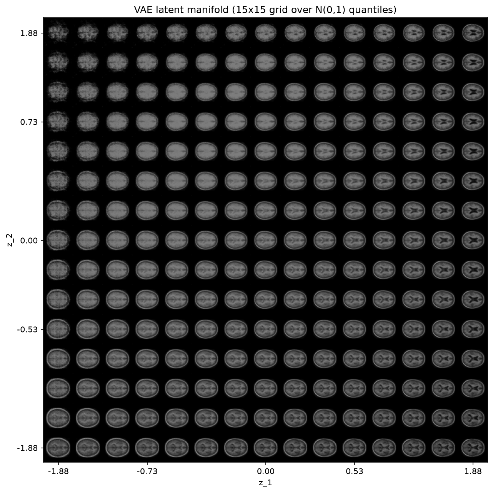
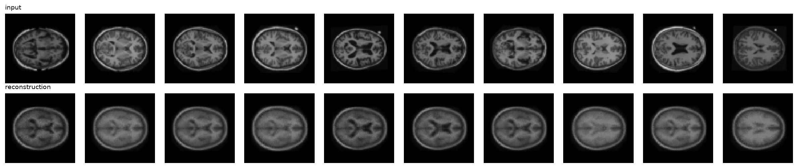
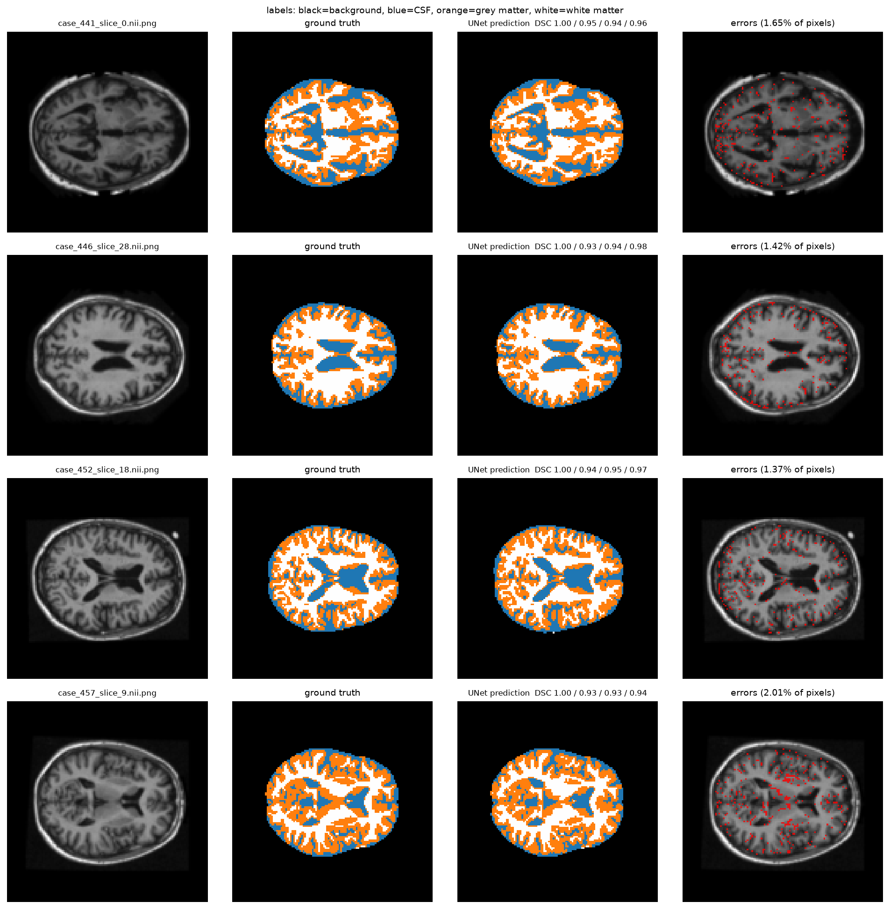

# Medium 实验结果与复现

本页记录本次在用户提供的 OASIS PNG 数据上运行的实验。已从课程PDF链接重新下载官方压缩包，并确认全部22656个PNG逐文件SHA-256一致；来源证据见 `docs/results/oasis_source_comparison.json`。原始数据 256×256；VAE 使用64×64，UNet使用128×128。所有结果应注明这一分辨率，不能当作原始256×256评价或 Rangpur 跑分。

## VAE：已完成的真实训练

- 9664张训练切片、1120张验证切片、544张测试切片；无 `max_samples` 限制。
- ConvVAE，latent_dim=2，base_channels=16，111429个参数。
- 15 epochs，batch64，Adam lr=0.001，beta=1，BCE重建项+KL，cosine学习率。
- 本次CPU训练约140秒；与另一实验并行，不能用于硬件基准比较。
- 按验证损失选择 epoch14；最佳验证负ELBO约1076.81/图。
- 模型：`results/medium_vae64/vae_latent2.pt`。
- 图像：`docs/figures/medium_vae_manifold.png`、`medium_vae_reconstructions.png`；完整图在模型目录。

训练后可以观察到潜空间中的脑切片形态连续变化。二维latent保留整体轮廓和较大的脑室结构，但重建明显平滑，不能恢复所有个体细节。流形图边缘部分样本有伪影，不能把这称为完美生成或临床有效模型。





复现（从仓库根目录，先激活安装了 requirements.txt 的Python环境）：

```bash
python part4_recognition/vae/train.py \
  --data_root "$HOME/Downloads/keras_png_slices_data" \
  --image_size 64 --base_channels 16 --latent_dim 2 \
  --epochs 15 --batch_size 64 --device cpu \
  --output_dir results/medium_vae64
```

## UNet：完整测试集四类 DSC 均超过0.9

全量训练图像与mask按128×128使用bilinear/nearest分别缩放；模型base_channels=8、depth=3，共121060参数。loss为交叉熵+soft Dice，使用随机水平翻转及强度增强。

第一阶段已完成1轮：验证DSC约 [0.996, 0.863, 0.894, 0.942]。原计划25轮，在第二轮完成前停止并保留第一轮checkpoint。未完成轮次的内存权重未用于下一阶段。

第二阶段从该checkpoint热启动，重新创建Adam和cosine学习率，lr=0.0005、最多10轮。根据验证集而非测试集，预先设定“所有类别验证DSC > 0.92”时停止；最佳checkpoint优先最大化最弱类别验证DSC，均值用于打破平局。热启动不等于恢复优化器训练状态。

```bash
# 重现第一阶段：第一轮内的学习率均为0.001，之后的调度不影响该轮checkpoint。
python part4_recognition/unet/train.py \
  --data_root "$HOME/Downloads/keras_png_slices_data" \
  --image_size 128 --base_channels 8 --depth 3 --epochs 1 \
  --batch_size 16 --augment --validation_only --device cpu \
  --output_dir results/medium_unet128

python part4_recognition/unet/train.py \
  --data_root "$HOME/Downloads/keras_png_slices_data" \
  --image_size 128 --base_channels 8 --depth 3 --epochs 10 \
  --batch_size 16 --augment --validation_only --lr 0.0005 --target_dsc 0.92 \
  --init_checkpoint results/medium_unet128/unet_best.pt --device cpu \
  --output_dir results/medium_unet128_refine

# 选择最终模型后执行一次完整测试评价；现场也使用该命令。
python part4_recognition/unet/predict.py \
  --data_root "$HOME/Downloads/keras_png_slices_data" \
  --checkpoint results/medium_unet128_refine/unet_best.pt \
  --device cpu --output_dir results/medium_unet_test
```

`dice_test.json` 保存逐类DSC、per-image mean、像素accuracy、checkpoint哈希、设备、计时和是否所有类别严格超过0.9。`categorical_test.npz`保存四张测试样例的 `[N,4,H,W]` hard one-hot 结果，每个像素四通道之和为1。

小样本 `results/smoke_unet` 只检查训练/推理管线，模型表现差，不能当作最终模型。开始训练前曾对前64张测试切片做管线冒烟验证；后续模型选择只使用验证集，最终完整测试在选择checkpoint后进行。

## Rangpur 与演示

本地实测不能代替实验表规定的集群运行。进入分配到的GPU节点并激活个人环境后：

```bash
# 提交前核实分区和数据路径；不要把占位值当作已验证配置。
sinfo
sbatch slurm/dawnbench.slurm

# 在交互式GPU作业中同时留下CIFAR推理、一轮训练和UNet推理日志。
bash scripts/run_cluster_demo.sh \
  results/part3_dawnbench/resnet18_cifar10.pt \
  results/medium_unet128_refine/unet_best.pt \
  /actual/path/to/keras_png_slices_data
```

此脚本强制检查CUDA，演示结果写入新的时间戳目录，正式训练权重不会被一轮演示覆盖。CIFAR首次下载到本地后，应将完整数据复制到集群或在允许联网节点下载；计算节点使用 `--no_download`。

本次尝试下载CIFAR-10时观察到约80 KB/s，预估下载约30分钟，因此停止下载；没有把这次中止写成真实CIFAR训练成功。DAWNBench训练入口通过合成数据的控制流程回归测试，真正的CIFAR训练准确率和A100时间仍待完成。

## 三分钟展示顺序

1. 0:00–0:35：说明各任务、Medium档位和本次结果来源；指出集群与课程证据。
2. 0:35–1:10：DFT算法复杂度、PCA训练集均值/SVD，以及CNN如何学习不同于PCA的特征。
3. 1:10–1:50：VAE图，解释mu/log_var、重参数化与KL约束；说明二维压缩的细节损失。
4. 1:50–2:35：UNet推理图、每类DSC、one-hot和skip connections；区分验证选模与测试评价。
5. 2:35–3:00：Git提交、数据检查、AI辅助与本人验证；准备接受代码追问。


## 最终固定模型的完整测试评价

第二阶段在第5轮触发预设验证停止条件（加上第一阶段1轮，共6轮完整训练）。最终checkpoint按验证集最弱类别选择，此后才评价完整544张测试切片。

| 标签 | 全测试集汇总DSC | 每图DSC均值 | 汇总DSC严格>0.9 |
|---|---:|---:|---|
| background | 0.9982 | 0.9982 | 是 |
| CSF | 0.9267 | 0.9119 | 是 |
| grey matter | 0.9401 | 0.9394 | 是 |
| white matter | 0.9665 | 0.9659 | 是 |

平均汇总DSC：0.9579；像素准确率：0.9841。
CPU推理544张耗时 4.64 秒（已加载模型与数据；不含PNG解码和绘图）。
所有数值是在 **128×128** 图像与mask上计算，不能声称已在原始256×256达到相同数值。
汇总DSC和每图均值在四类上都超过0.9，但这不意味着每张切片的每类DSC都>0.9。

第二阶段训练约 1053 秒，第一阶段完整轮约202秒；另有被中止的部分轮次。
Checkpoint SHA-256：`5c53b4b0bbc888934901b8f5c2fe9c72e6728e4429d09f5d64dac3808721c1ec`。
机器可读结果：`docs/results/medium_unet_test.json`；训练历史：`docs/results/medium_unet_validation.json`。



## 交付文件和完成边界

- GitHub中保存代码、报告、图像、小型JSON与日志；大型/二进制训练输出仍按原项目规则放在git忽略的 `results/`。
- 随本次交付的 `medium_models_and_results.zip` 含VAE、最终UNet、初始UNet及完整结果目录。将其解压到仓库根目录即可运行上面的推理命令。
- 本次21项回归测试全部通过，Ruff与Python 3.10语法兼容检查通过。
- Medium的本地VAE和UNet结果要求已有实际证据。最终分数仍取决于本人讲解、现场推理、Git课程证明及实验表要求的集群演示；DAWNBench的准确率/计时尚无达标证据。
